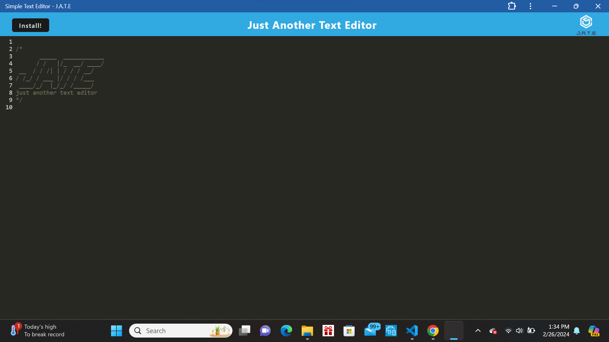

## Text Editor

## Description
This application is a simple text editor for you to write down thoughts, notes, lists, etc. This application is able to run in your web browser or, if you wish, downloaded to your desktop for use there. Any data you enter into your editor will persist through each page refresh as well as through closing the page and opening it again.

## Visuals

## Installation
This application is already deployed to Render. Users may follow the link below to access this program. No other installation process needed.

https://text-editor-epl0.onrender.com/

## Usage
This application can be used for a number of things. For example, I myself use it as a to do list. The numbers along the side of the page make it easy to keep track of how many tasks I have left. When I complete a task I can just delete it from my list and continue on. All changes I make will be kept on the page even if I close it out and re-open it later.

## Roadmap
N/A

## Contributing
N/A 

## Authors and acknowledgment
This program was written by myself, Ida Whitcomb. With help supplied by the AskBCS learning assistants and starter code supplied by the UNH coding bootcamp staff.

## License
N/A

## Project status
This project is complete.